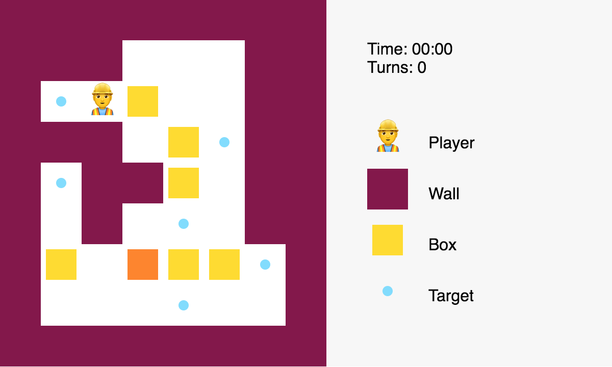

# Sokoban - interview coding session

The goal of this interview session is to implement Sokoban game. If you are not
familiar how the game works you can see live version on
[https://sokoban.info](sokoban.info).

I don't expect that the result would be a finished game. What I try to evaluate
is how people think and what are they able to achieve in limited time.

The repository contains a skeleton of the game in React - JSX markup and CSS
styles.

## `npm start`

Runs the app in the development mode.  Open
[http://localhost:3000](http://localhost:3000) to view it in the browser.

The page will reload if you make edits.  You will also see any lint errors in
the console.
